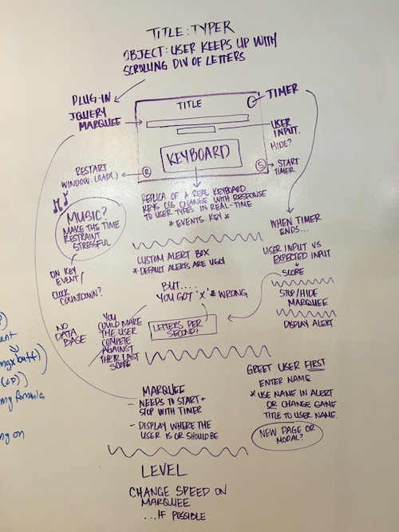
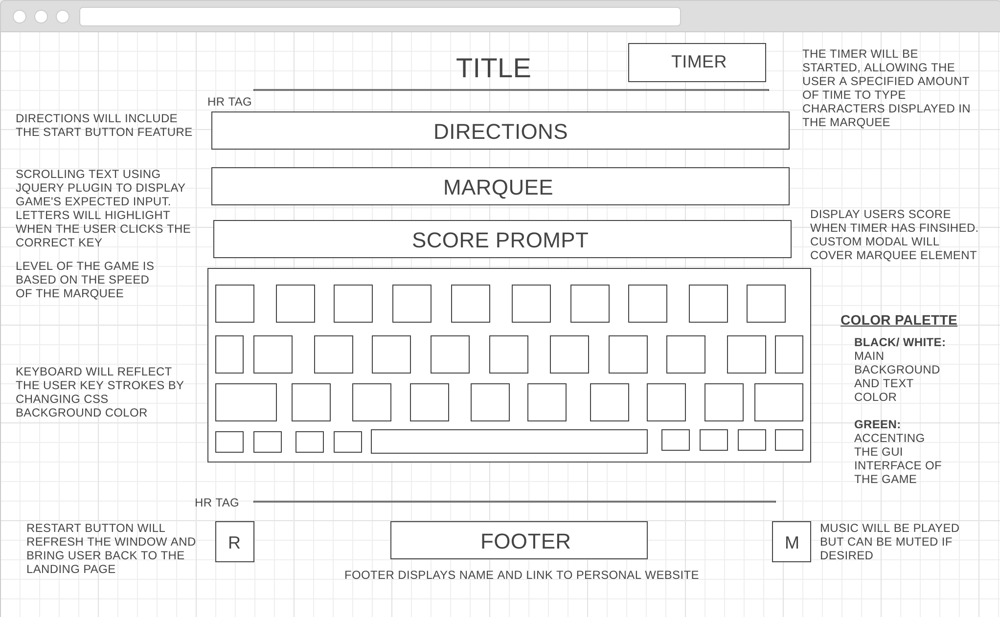

# Project Overview

## Project Schedule

The schedule below reflects the required deadlines and was used to keep track of developer progress to align with expectations. Approval for deliverables was required by the end of the corresponding say excluding `Saturday` and `Sunday`.


| Day         | Deliverable                    |
| ----------- | ------------------------------ |
| Day 1: Tues | Wireframes and Priority Matrix |
| Day 2: Wed  | Game Approval and MVP          |
| Day 3: Thur | Pseudocode / actual code       |
| Day 4: Fri  | Basic Clickable Model          |
| Day 5: Sat  | Working Prototype              |
| Day 6: Sun  | Slides / Bugs                  |
| Day 7: Mon  | Project Presentations          |

## Project Description

Typer is a one-player, speed and accuracy typing application designed to give an accurate type speed per second with time constraints. Inspired by (<http://typing.io/>).


## Priority Matrix

Prioritized features include the following:

-   Storing user keyboard events
-   Replicated keyboard with user-corresponding CSS
-   Game logic triggered by start button / restart button
-   Timer based time restraint
-   Implementation of jQuery Marquee plugin
-   Music and CSS animations
-   Score displayed with custom alert box
-   User input based greeting


### MVP/PostMVP

The functionality is divided into two separate lists: MPV and PostMVP.

| Component      | MPV / PostMVP | Estimated Time | Actual Invested |
| -------------- | :-----------: |  :-----------: | :-------------: |
| Design         | MPV           | 1hrs           | 2hrs            |
| Mobile Design  | MPV           | 2hrs           | 2hrs            |
| Input          | MPV           | 3hrs           | 4hrs            |
| Keyboard       | MPV           | 3hrs           | 4hrs            |
| Timer          | MPV           | 1hrs           | 1hrs            |
| Marquee        | MPV           | 1hrs           | 30min           |
| Music          | PostMVP       | 1hrs           | 30min           |
| Score          | MPV           | 30min          | 2hrs            |
| Greeting Page  | PostMVP       | 1hrs           | 1hrs            |
| Start/ Restart | MPV           | 30min          | 3hrs            |
| Level/ Name    | PostMVP       | 1hrs           | 9hrs            |
| Total Time     |               | 15hrs          | 25hrs           |


## Wireframes




## Game Components

### Landing Page

When the game is loaded the user will see a page that states the following:

-   Prompt for the user to input name
-   Title and instructions
-   Full landing page with GUI interface
-   Start and restart buttons

### Game Initialization

When the user clicks on the start button, the user will see a page with the following state:

-   Timer will begin automatically
-   Marquee will with a short time delay to prepare the user
-   The keyboard will animate to corresponding key events

### Playing The Game

When the user lands on the site, a prompt will request a user name to be used later for displaying personalized score as well as level. The level will be reflected by the speed of the marquee. The modal will be removed and filling required information and will direct to the home page of game. The title and directions are displayed at the top of the screen for clear instructions. When the user presses play, the timer and marquee will begin. The user will then repeat the scrolling texts to receive an accuracy and completion score when the timer has finished. A custom alert will display user name and the score: accuracy of total typed keys. The user will then be able to restart the same if desired.

### Winning The Game

After the timer is finished, score will be displayed:

-   Correctly typed letters compared to game's expected set
-   Restart game continuously displayed at the bottom of screen

### Game Reset

When the restart game button is clicked, the window will reload for a fresh game and user:

-   Score to be reset to 0
-   User personal information and previous key events will no longer be stored
-   Timer will be reset

## Functional Components

Based on the initial logic defined in the previous game phases section, logic is further broken down into functional components. The following code is encapsulated for the purpose of reusability.


| Function | Description                                                           |
| -------- | --------------------------------------------------------------------- |
| Timer    | Sets a timer that be called anywhere in the application               |
| Marquee  | Runs The Marquee plugin where specified or automatically on page load |
| Greeting | Grabs the local storage of the initial landing page                   |
| Compare  | Compares the user input to the expected input for game functionality  |
| Reload   | Reloads the page for a hard restart where triggered                   |


## Helper Functions

Helper functions are generic enough that they can be reused in other applications. This section documents all helper functions that fall into this category.


| Function       | Description                                   |
| -------------- | --------------------------------------------- |
| Timer Function | Sets a timer that can easily be customized    |
| Restart        | Restarts the page using the window's location |
| Alert Box      | Custom alert box to replace default alert css |
| Sound          | Stops the sound played by embedded video      |


## Additional Libraries


| Library        | Description                                                                 |
| -------------- | --------------------------------------------------------------------------- |
| Google Fonts   | Used to set font widely supported by various browsers                       |
| Jquery         | Used to enable easy DOM traversing, manipulating, event handling, animating |
| Jquery Marquee | Plugin to scroll text like traditional marquee with CSS3 support            |
| Youtube        | Embeded Youtube video for background sound                                  |


## Code Snippet

The below code snippet implemented Jquery DOM manipulation and ES6 syntax to match the user key events to id's assigned to HTML elements.

```
$(document).on('keypress', function(event) {
    let id = event.key;
    let selectedId = $(`#${id}`).attr('id');
    let selectedElement = $(`#${selectedId}`);
    if(id === selectedId){
        selectedElement.css('background-color', 'pink');
        setTimeout(function(){
        selectedElement.css('background-color', 'white');
        }, 200);
    }
});
```


## jQuery Discoveries

-   Jquery's Marquee Plugin (<http://cdn.jsdelivr.net/jquery.marquee/1.4.0/jquery.marquee.min.js>)
-   Tutorial to create a replicated keyboard with CSS and Jquery (<https://code.tutsplus.com/tutorials/creating-a-keyboard-with-css-and-jquery--net-5774>)

## Change Log


## Issues and Resolutions

ERROR: Input could not be hidden and still track user input

RESOLUTION: CSS blends it in with the background

ERROR: Could not access user input from greeting page throughout the rest of the application

RESOLUTION: Local Storage to pass the values
